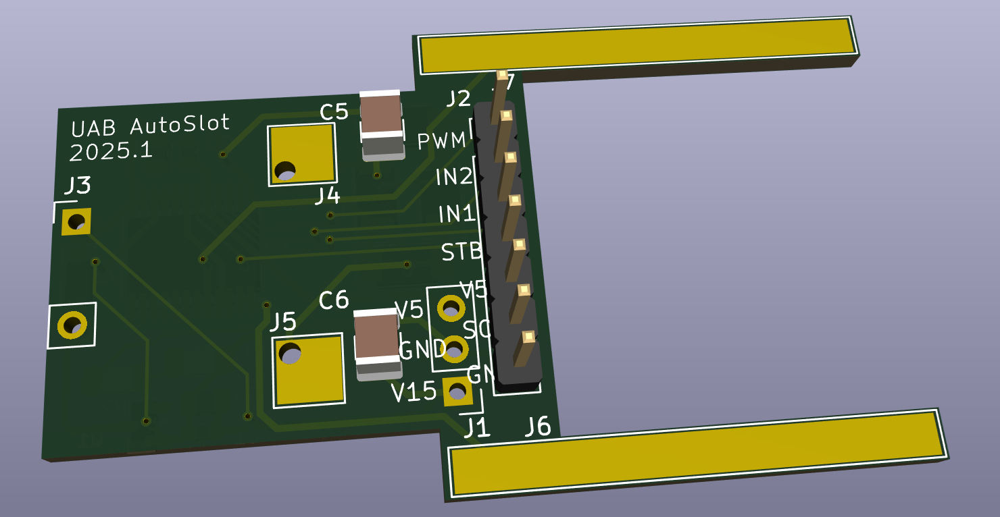
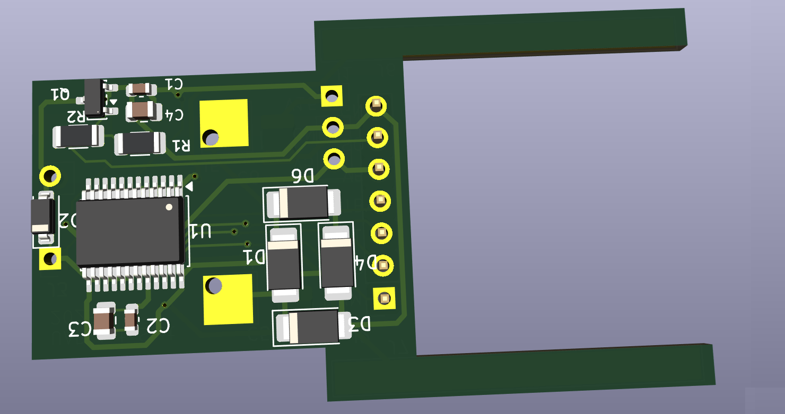
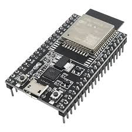
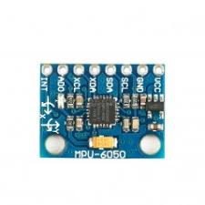

# AutoSlot

This is a repo to create an autonomous slot car.
This is an activity done under the [Cyberphysical Systems](https://guies.uab.cat/guies_docents/public/portal/html/2025/assignatura/44732/en)  course in the [Research and Innovation in Computer based Science and Engineering Master](https://www.uab.cat/web/estudiar/official-master-s-degrees/general-information/-1096480962610.html?param1=1345875382068) of the [UAB](https://www.uab.cat/)

## Idea
We want students to create autonomous racing slot cars.

## HW Platform
SCX cars are modular, giving an exccellent opportunity to be a base for custom electronic designs.

### Shield replacement PCB
We create a PCB to replace the existing controller of SCX. It exposes some pins to get voltage, control the motor and the solenoid.

    
    

### External controller

Students can create any system that connects to the previous shield.
We provide a reference design based on ESP32 DevKit and an IMU .

    
    

## Partners

We have received the support from Scale Competition Xtreme, S.L **[SCX](https://scx-brand.com/)**

